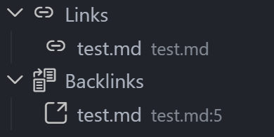

# MLink

[中文](README.md)

MLink is a VS Code extension for viewing links and backlinks in a Markdown workspace.



## Features

- Shows outgoing links and backlinks for the current Markdown file.
- Supports relative paths, workspace absolute paths, and local links without the `.md` suffix.
- Opens linked files from the sidebar; directory links are revealed in the Explorer.
- Highlights the leading `#` of headings referenced through `#heading` links.
- Indexes workspace Markdown files and updates after file changes.
- Provides the `MLink: Refresh Workspace Index` command for manual reindexing.

## Usage

1. Open a VS Code workspace that contains Markdown files.
2. Open any Markdown file.
3. Open MLink from the Activity Bar and inspect `Links` and `Backlinks`.

## Development

```bash
npm install
npm run compile
npm run unit-test
```

Common commands:

- `npm run check-types`: run TypeScript type checks.
- `npm run lint`: run ESLint.
- `npm run unit-test`: run unit tests.
- `npm run compile`: check and bundle the extension.

## Limitations

MLink currently parses standard inline Markdown links such as `[text](path)`. Wiki links and reference-style links are not supported yet.
